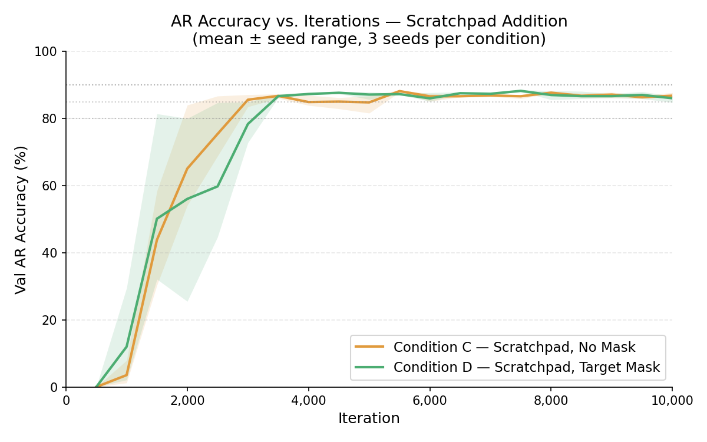
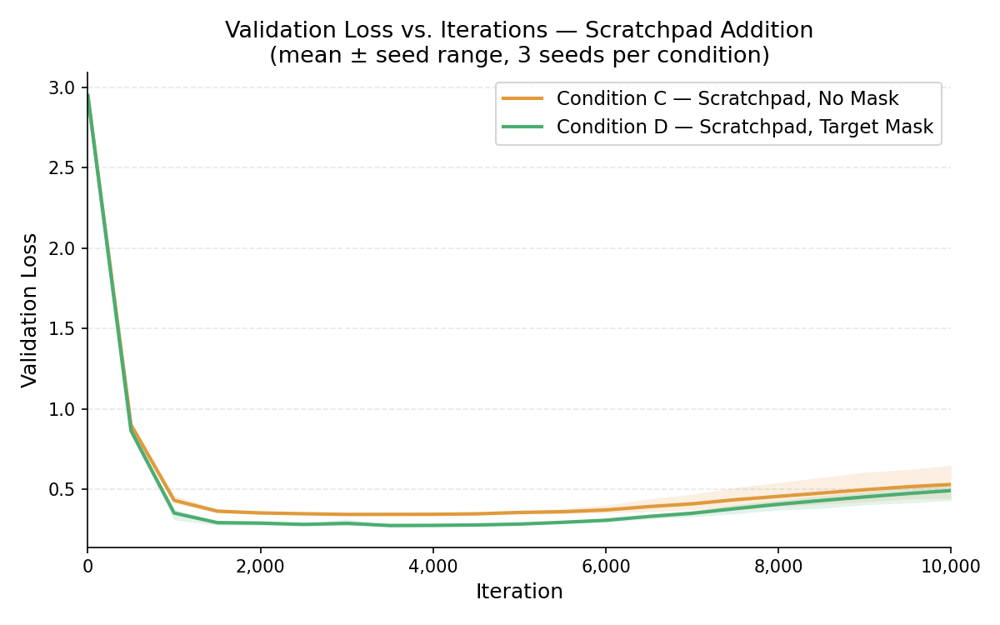

# Experiment Report: Target Masking — Convergence Speed vs. Accuracy Ceiling

## 1. Motivation and Hypothesis

Experiment 4 (Validation) established that target masking is necessary for high AR generation accuracy. With `block_size=64`, the masked model reached 88.0% Val AR accuracy versus 76.7% for the unmasked model after 5,000 iterations. However, Exp 4 did not measure how quickly each condition converges, nor whether the unmasked model eventually catches up given more training time.

**Hypothesis:** Target masking concentrates the gradient signal on output tokens only. This should translate into faster convergence — i.e., the masked model should reach any given accuracy threshold in fewer iterations.

**Secondary question:** If the unmasked model simply needs more iterations, how large is the final accuracy gap at 10,000 iterations?

---

## 2. Experimental Setup

- **Model:** `n_layer=6, n_head=4, n_embd=128, block_size=64` — identical to Exp 4
- **Dataset:** 2-digit addition, exhaustive 10,000 samples, `{"input": "12+34", "output": "46"}`
- **Split:** 9,000 train / 1,000 val (shuffled, same format as Exp 4)
- **Training script:** `train_benchmark.py` with `max_iters=10000`, `eval_interval=500`, `enable_tf_eval=False`
- **Eval metric:** Autoregressive (AR) generation exact-match accuracy, collected post-hoc on 20 named checkpoints per run (`ckpt_00500.pt` through `ckpt_10000.pt`)
- **Replications:** 3 seeds per condition (1337, 1338, 1339) to measure run-to-run variance
- **Hyperparameters:** `lr=3e-4`, `min_lr=3e-5`, `warmup_iters=200`, `lr_decay_iters=10000`, `batch_size=128`

### Conditions

| Condition | `target_mask` | Description |
|---|---|---|
| A — No mask | `False` | Baseline; loss computed over all tokens |
| B — Target mask | `True` | Loss computed on output tokens only (input region masked with `ignore_index=-1`) |

### Engine Changes

To support post-hoc convergence curve collection, two small patches were made:
- `train_benchmark.py`: saves `ckpt_{iter:05d}.pt` alongside `ckpt.pt` at every `eval_interval`
- `eval_generation.py`: adds optional `--ckpt_path` argument to load a specific snapshot
- `train_benchmark.py`: `seed` made configurable via CLI (was hardcoded to 1337)

---

## 3. Results

### 3.1 AR Generation Accuracy — Full Convergence Curves

**Condition A (No Mask):**

| Iter | s1 | s2 | s3 | Mean |
|---|---|---|---|---|
| 500 | 0.5% | 0.6% | 0.2% | 0.4% |
| 1000 | 1.0% | 1.0% | 0.9% | 1.0% |
| 1500 | 12.1% | 2.5% | 4.5% | 6.4% |
| 2000 | 52.1% | 12.2% | 32.9% | 32.4% |
| 2500 | 69.0% | 36.5% | 59.3% | 54.9% |
| 3000 | **81.9%** | 60.6% | 72.5% | 71.7% |
| 3500 | 83.4% | 66.5% | 79.6% | 76.5% |
| 4000 | 84.0% | 61.9% | **82.7%** | 76.2% |
| 4500 | 81.3% | 72.9% | 79.5% | 77.9% |
| 5000 | 82.1% | **83.3%** | 81.1% | 82.2% |
| 5500 | **85.0%** | **85.2%** | 82.8% | 84.3% |
| 6000 | 83.9% | 81.0% | 81.4% | 82.1% |
| 7000 | 83.5% | 83.0% | 82.7% | 83.1% |
| 8000 | 85.2% | 80.6% | 82.9% | 82.9% |
| 9000 | 84.7% | 82.3% | **84.6%** | 83.9% |
| 10000 | 83.9% | 82.5% | 84.2% | **83.5%** |

**Condition B (Target Mask):**

| Iter | s1 | s2 | s3 | Mean |
|---|---|---|---|---|
| 500 | 0.7% | 0.9% | 1.0% | 0.9% |
| 1000 | 1.4% | 1.3% | 0.9% | 1.2% |
| 1500 | 4.6% | 23.6% | 3.3% | 10.5% |
| 2000 | 23.1% | 42.9% | 18.3% | 28.1% |
| 2500 | 39.5% | 40.8% | 34.6% | 38.3% |
| 3000 | 55.7% | 69.8% | 48.1% | 57.9% |
| 3500 | 72.6% | 71.9% | 67.0% | 70.5% |
| 4000 | **82.5%** | 72.8% | 59.9% | 71.7% |
| 4500 | 83.1% | 77.1% | 68.5% | 76.2% |
| 5000 | 81.5% | **85.9%** | **84.3%** | 83.9% |
| 5500 | 79.3% | 84.2% | 84.4% | 82.6% |
| 6000 | 87.1% | 87.0% | 87.5% | 87.2% |
| 7000 | **89.8%** | 89.3% | 86.8% | 88.6% |
| 8000 | 88.1% | **90.2%** | 89.5% | 89.3% |
| 9000 | **90.2%** | **90.4%** | **90.2%** | **90.3%** |
| 10000 | 89.8% | 90.2% | 89.8% | **89.9%** |

### 3.2 Iterations to Reach Accuracy Thresholds

| Threshold | A — s1 | A — s2 | A — s3 | A — mean | B — s1 | B — s2 | B — s3 | B — mean |
|---|---|---|---|---|---|---|---|---|
| 80% | 3,000 | 5,000 | 4,000 | **4,000** | 4,000 | 5,000 | 5,000 | **4,667** |
| 85% | 5,500 | 5,500 | never | — | 6,000 | 5,000 | 6,000 | **5,667** |
| 90% | never | never | never | — | 9,000 | 8,000 | 9,000 | **8,667** |

*Threshold = first checkpoint at or above that accuracy value.*

### 3.3 Validation Loss

Val loss is logged every 500 iterations. Condition B decreases monotonically throughout training. Condition A reaches a minimum around iter 3,000 then diverges strongly.

| Iter | A — s1 | A — s2 | A — s3 | B — s1 | B — s2 | B — s3 |
|---|---|---|---|---|---|---|
| 0 | 2.65 | 2.68 | 2.68 | 2.64 | 2.67 | 2.59 |
| 500 | 1.54 | 1.55 | 1.54 | 1.30 | 1.38 | 1.38 |
| 1000 | 1.42 | 1.41 | 1.45 | 1.01 | 1.01 | 1.03 |
| 1500 | 1.20 | 1.36 | 1.23 | 0.53 | 0.41 | 0.62 |
| 2000 | 1.10 | 1.20 | 1.13 | 0.30 | 0.21 | 0.26 |
| 2500 | 1.07 | 1.12 | 1.09 | 0.20 | 0.17 | 0.21 |
| 3000 | **1.07** | 1.09 | **1.07** | 0.19 | 0.15 | 0.18 |
| 3500 | 1.08 | 1.07 | 1.08 | 0.15 | 0.14 | 0.15 |
| 4000 | 1.10 | 1.08 | 1.11 | 0.14 | 0.13 | 0.15 |
| 5000 | 1.35 | 1.11 | 1.34 | 0.14 | 0.13 | 0.14 |
| 6000 | 1.76 | 1.25 | 1.74 | 0.13 | 0.13 | 0.13 |
| 7000 | 2.19 | 1.45 | 2.20 | 0.12 | 0.12 | 0.13 |
| 8000 | 2.49 | 1.71 | 2.55 | 0.12 | 0.12 | 0.13 |
| 9000 | 2.69 | 1.98 | 2.84 | 0.12 | 0.12 | 0.12 |
| 10000 | 2.90 | 2.14 | 3.04 | 0.12 | 0.12 | 0.12 |

Cond A minimum val loss: ~1.07 at iter 3,000. Final val loss: 2.14–3.04.

Cond B minimum val loss: ~0.12 at iter 10,000 (still decreasing). Final val loss: ~0.12.

<!-- val_loss_curve.png -->

### 3.4 Training Overhead

| Run | Runtime (s) | GPU Power (avg %) |
|---|---|---|
| cond_A_s1 | 188 | ~59% |
| cond_A_s2 | 180 | ~58% |
| cond_A_s3 | 172 | ~60% |
| **Cond A mean** | **180** | **~59%** |
| cond_B_s1 | 190 | ~60% |
| cond_B_s2 | 212 | ~55% |
| cond_B_s3 | 181 | ~58% |
| **Cond B mean** | **194** | **~58%** |

Target masking adds ~8% wall-clock overhead. GPU power utilization is indistinguishable between conditions.

---

## 4. Analysis

### 4.1 The Hypothesis Is Partially Wrong

The hypothesis predicted that target masking would reach any given accuracy threshold in fewer iterations. The data does not support this for the 80% threshold — both conditions reach 80% at roughly the same iteration count (~4,000–5,000 iters). At the 85% threshold, Cond B's mean is only marginally slower than Cond A's (5,667 vs 5,500 iters for the two s1/s2 runs that reached it), and Cond A's s3 never reaches 85% at all.

The early training phases (iter 0–5,000) look nearly identical between conditions in terms of AR accuracy. The gradient concentration effect of masking does not appear to speed up early convergence.

### 4.2 The Real Effect Is a Higher Accuracy Ceiling

The difference between conditions becomes decisive after iter 5,000. Condition B continues to improve, reaching ~90% by iter 8,000–9,000 and stabilizing there. Condition A plateaus and oscillates between 80–85% with no further improvement across the remaining 5,000 iterations.

| Phase | Cond A | Cond B |
|---|---|---|
| iter 0–5,000 | Similar convergence, ~82% mean | Similar convergence, ~84% mean |
| iter 5,000–10,000 | Flat oscillation, 80–85% | Sustained improvement to 89–90% |
| Final accuracy | **83.5%** | **89.9%** |

### 4.3 Val Loss Divergence Explains the Plateau

The core mechanism is revealed by the val loss curves. Condition A's val loss reaches its minimum (~1.07) around iter 3,000, then steadily diverges, reaching 2.1–3.0 by iter 10,000. This is a classic overfitting signature: the model has memorized training patterns that do not generalize. The patterns being memorized are the input tokens and the transitions between consecutive equations in the concatenated training stream. Without masking, the gradient pushes the model to predict arbitrary input numbers — patterns that are meaningless at AR generation time when no prior context exists.

Condition B's val loss decreases monotonically throughout all 10,000 iterations (2.6 → 0.12), indicating a clean optimization landscape with no overfitting pressure. Because input tokens are masked out, there are no spurious patterns for the model to memorize.

### 4.4 Val Loss Divergence Does Not Collapse AR Accuracy

A notable observation: despite Cond A's val loss diverging to 2.1–3.0, its AR accuracy does not collapse — it stays in the 80–85% range. This mirrors the "loss vs. accuracy paradox" from Exp 4: val loss measures average token-level confidence across the entire sequence, while AR accuracy measures only the output tokens. What degrades in Cond A is the model's confidence on input tokens and inter-sequence transitions; the output-token predictions remain functional but plateau.

This decoupling means val loss is not a reliable proxy for AR accuracy in the unmasked setting. Monitoring val loss alone would give a misleading picture of how badly the model has deteriorated.

### 4.5 Overhead Is Negligible

Target masking adds ~8% to wall-clock training time and has no measurable effect on GPU utilization. The per-sample masking operation (`apply_target_mask` in `comp560ext.py`) runs on CPU before the device transfer and is not the bottleneck. The ~14-second absolute difference (194s vs 180s) is well within run-to-run variance from other sources.

---

## 5. Conclusion

**The original hypothesis — that target masking would converge faster — is not supported.** Early convergence speed to 80% is similar between conditions (~4,000–5,000 iters).

**The actual effect of target masking is a higher accuracy ceiling, not faster convergence.** By preventing the model from optimizing over input tokens, masking eliminates the val loss divergence that caps Condition A at ~83.5%. Condition B achieves ~89.9% — a 6.4-point improvement — using the same model, data, and compute budget, at a cost of only ~8% additional wall-clock time.

The val loss curves are the clearest signal: Cond B converges cleanly to 0.12; Cond A diverges to 2.1–3.0. The masking boundary defines what the model is and is not allowed to learn, and that boundary is the decisive factor in long-run accuracy.

---

## 7. Stretch Conditions — Scratchpad (C vs D)

### 7.1 Setup

Same model and hyperparameters as conditions A/B. Key differences:
- `dataset = scratchpad_1_2digit` — output is bracket-based carry chain (e.g. `[5+7=12,C1][1+2+1=4,C0]42`) instead of plain answer
- `block_size = 128` — required to accommodate scratchpad sequence length
- Conditions C (no mask) and D (target mask), 3 seeds each (1337–1339)

Scratchpad outputs are ~3–5× longer than plain outputs, so the input-to-output ratio is much lower. If the secondary hypothesis holds (masking benefit scales with output length), the C vs D gap should be larger than the A vs B gap.

### 7.2 AR Generation Accuracy — Full Convergence Curves

**Condition C (Scratchpad, No Mask):**

| Iter | s1 | s2 | s3 | Mean |
|---|---|---|---|---|
| 500 | 0.0% | 0.0% | 0.0% | 0.0% |
| 1000 | 1.5% | 7.9% | 1.2% | 3.5% |
| 1500 | 42.8% | 58.4% | 30.3% | 43.8% |
| 2000 | 57.1% | 84.0% | 54.1% | 65.1% |
| 2500 | 70.7% | 86.7% | 68.8% | 75.4% |
| 3000 | **86.2%** | 87.1% | 83.5% | 85.6% |
| 3500 | 86.9% | 87.3% | **86.0%** | **86.7%** |
| 4000 | 86.9% | 83.9% | 83.9% | 84.9% |
| 4500 | 82.9% | 86.0% | 86.2% | 85.0% |
| 5000 | 81.6% | 86.7% | 86.1% | 84.8% |
| 5500 | **88.2%** | 87.8% | **88.5%** | **88.2%** |
| 6000 | 87.4% | 87.3% | 85.1% | 86.6% |
| 7000 | 87.0% | 87.0% | 86.6% | 86.9% |
| 8000 | 87.7% | **87.9%** | 87.5% | 87.7% |
| 9000 | 86.1% | 87.8% | 87.5% | 87.1% |
| 10000 | 86.3% | 87.7% | 86.4% | **86.8%** |

**Condition D (Scratchpad, Target Mask):**

| Iter | s1 | s2 | s3 | Mean |
|---|---|---|---|---|
| 500 | 0.0% | 0.0% | 0.0% | 0.0% |
| 1000 | 4.4% | 29.5% | 2.1% | 12.0% |
| 1500 | 32.1% | 81.4% | 36.9% | 50.1% |
| 2000 | 25.5% | 80.0% | 62.6% | 56.0% |
| 2500 | 84.7% | 49.9% | 44.7% | 59.8% |
| 3000 | 72.8% | 77.4% | **84.9%** | 78.4% |
| 3500 | 86.5% | 87.3% | 86.2% | **86.7%** |
| 4000 | 87.7% | 87.2% | 87.0% | **87.3%** |
| 4500 | **87.7%** | 87.4% | **87.9%** | **87.7%** |
| 5000 | 85.7% | **87.9%** | 87.8% | 87.1% |
| 5500 | 87.1% | 87.2% | 87.5% | 87.3% |
| 6000 | 85.1% | 87.7% | 85.2% | 86.0% |
| 7000 | 87.4% | 87.5% | 87.2% | 87.4% |
| 8000 | **88.3%** | 87.1% | 85.6% | 87.0% |
| 9000 | 87.4% | 86.2% | 86.4% | 86.7% |
| 10000 | 86.7% | 84.8% | 86.6% | **86.0%** |

<!-- Upload results/AR_accuracy_convergence_curve_cd.png and replace src -->

### 7.3 Iterations to Reach Accuracy Thresholds

| Threshold | C — s1 | C — s2 | C — s3 | C — mean | D — s1 | D — s2 | D — s3 | D — mean |
|---|---|---|---|---|---|---|---|---|
| 80% | 3,000 | 2,000 | 3,000 | **2,667** | 2,500 | 1,500 | 3,000 | **2,333** |
| 85% | 3,000 | 2,500 | 3,500 | **3,000** | 3,500 | 3,500 | 3,500 | **3,500** |
| 90% | never | never | never | — | never | never | never | — |

### 7.4 Validation Loss

Both conditions show val loss divergence after iter ~3,500 — unlike condition B (plain, masked) which decreased monotonically. However, the divergence in C/D is far less severe than in condition A (plain, unmasked), which reached 2.1–3.0 by iter 10,000.

| Iter | C — s1 | C — s2 | C — s3 | D — s1 | D — s2 | D — s3 |
|---|---|---|---|---|---|---|
| 0 | 2.95 | 2.94 | 2.96 | 2.95 | 2.94 | 2.96 |
| 500 | 0.920 | 0.895 | 0.888 | 0.887 | 0.864 | 0.840 |
| 1000 | 0.413 | 0.416 | 0.462 | 0.372 | 0.308 | 0.375 |
| 2000 | 0.355 | 0.344 | 0.359 | 0.302 | 0.275 | 0.290 |
| 3000 | **0.343** | **0.343** | **0.344** | 0.314 | 0.275 | 0.274 |
| 3500 | 0.343 | 0.344 | 0.343 | 0.274 | **0.274** | **0.275** |
| 5000 | 0.364 | 0.356 | 0.346 | 0.278 | 0.284 | 0.288 |
| 7000 | 0.372 | 0.469 | 0.387 | 0.328 | 0.359 | 0.365 |
| 10000 | 0.442 | 0.648 | 0.499 | 0.430 | 0.510 | 0.534 |

C minimum val loss: ~0.343 at iter 3,000–3,500. Final val loss: 0.44–0.65.
D minimum val loss: ~0.274 at iter 3,500–4,000. Final val loss: 0.43–0.53.

<!-- Upload results/val_loss_curve_cd.png and replace src -->

### 7.5 Masking Efficiency Gap: Plain vs Scratchpad

| Comparison | Final Accuracy Gap (masked − unmasked) |
|---|---|
| A vs B (plain, 10k iters) | **+6.4pp** (83.5% → 89.9%) |
| C vs D (scratchpad, 10k iters) | **−0.8pp** (86.8% → 86.0%) |

The secondary hypothesis is **not confirmed**. C and D perform nearly identically, with the unmasked condition (C) marginally higher at 10,000 iterations.

### 7.6 Training Overhead

| Run | Runtime (s) | GPU Power (avg %) |
|---|---|---|
| cond_C_s1 | 230 | ~75% |
| cond_C_s2 | 232 | ~74% |
| cond_C_s3 | 229 | ~75% |
| **Cond C mean** | **230** | **~75%** |
| cond_D_s1 | 248 | ~84% |
| cond_D_s2 | 251 | ~80% |
| cond_D_s3 | 239 | ~85% |
| **Cond D mean** | **246** | **~83%** |

Target masking adds ~7% wall-clock overhead on scratchpad, consistent with the ~8% overhead observed on plain addition (conditions A/B).

### 7.7 Analysis

**The secondary hypothesis is not confirmed.** C and D converge to the same accuracy ceiling (~86–88%), and neither reaches 90%. The C vs D gap at 10,000 iterations is effectively zero (−0.8pp), compared to the 6.4pp gap between A and B.

The explanation lies in the token ratio. For plain addition, the input (`12+34=`) accounts for ~70% of each sequence, making the unmasked gradient heavily polluted by input-prediction noise. For scratchpad, the input accounts for only ~22% of the sequence (the output bracket chain dominates). This means masking removes far less noise per sequence in the scratchpad setting — and accordingly, the accuracy benefit disappears.

A second factor is block density. With `block_size=128` and scratchpad sequences averaging ~32 characters each, a block contains only ~4 equations. With `block_size=64` and plain sequences averaging ~8 characters, a block contains ~8 equations. Fewer equation boundaries per block reduces the opportunity for the unmasked model to memorize cross-equation transitions, weakening the overfitting pressure that produced A's val loss collapse.

This is consistent with the val loss data: condition C diverges to 0.44–0.65 by iter 10,000, far less catastrophic than condition A's 2.1–3.0. The overfitting mechanism is still present in C, but its magnitude is greatly reduced by the longer sequence format.

Interestingly, condition D (masked, scratchpad) also shows val loss divergence — something not observed in condition B (masked, plain). With complex multi-token bracket outputs, some degree of overfitting to the output structure appears unavoidable even with masking. This does not hurt AR accuracy because the accuracy measure only checks final answer correctness, not whether every bracket token matches exactly.

**Summary:** The masking benefit scales with the fraction of the sequence that is input, not with the absolute length of the output.

---

## 6. Comparison with Exp 4

| Experiment | Condition | Iterations | Val AR Accuracy |
|---|---|---|---|
| Exp 4 | No mask, block_size=64 | 5,000 | 76.7% |
| Exp 4 | Target mask, block_size=64 | 5,000 | 88.0% |
| Exp 6 | No mask — mean (3 seeds) | 10,000 | 83.5% |
| Exp 6 | Target mask — mean (3 seeds) | 10,000 | **89.9%** |

Doubling iterations from 5,000 to 10,000 improves Cond A by ~6.8 points (76.7% → 83.5%), confirming that the unmasked model does benefit from more training. However, it does not catch up with the masked model, which shows only marginal improvement from 88.0% to 89.9% over the same additional 5,000 iterations — suggesting the masked model largely converged by iter 5,000.
