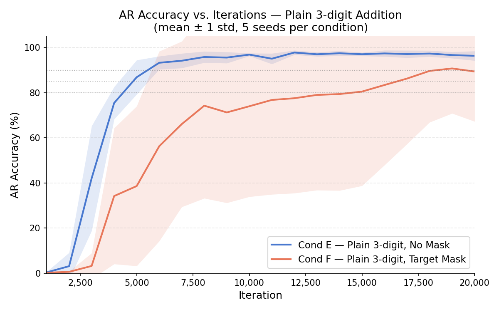
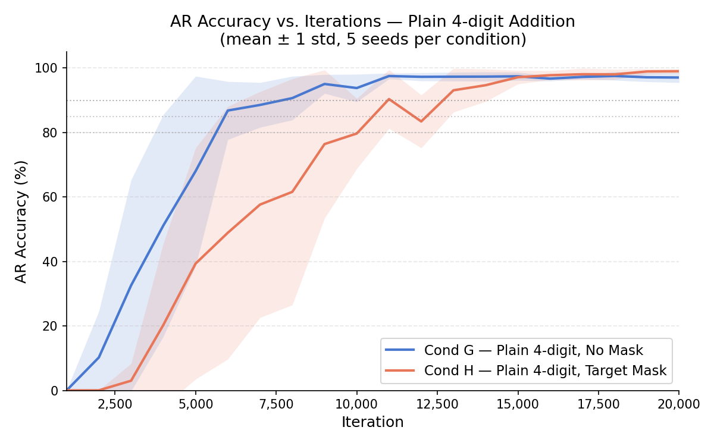
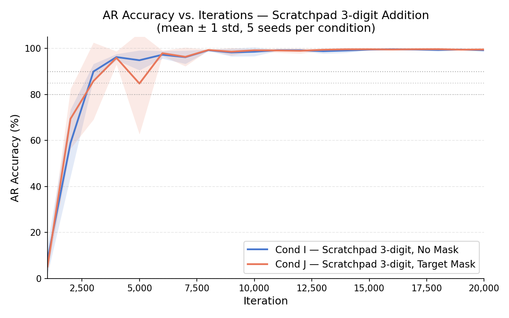
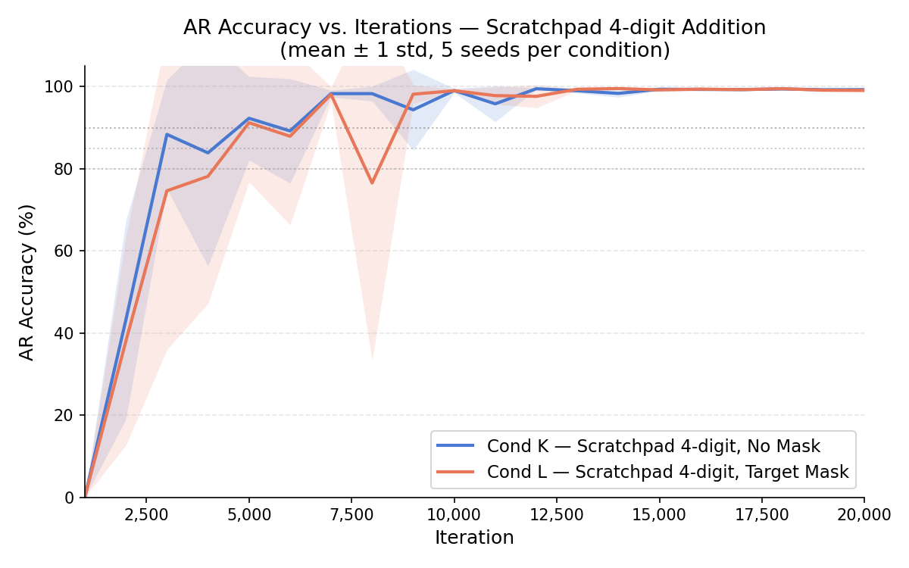
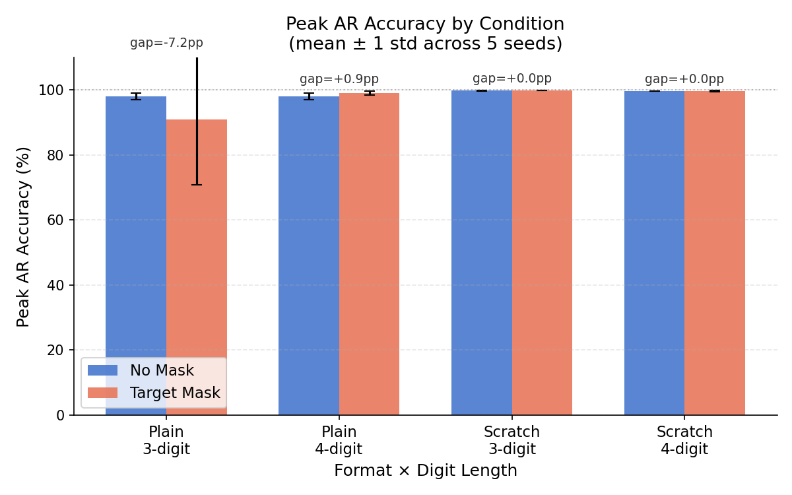
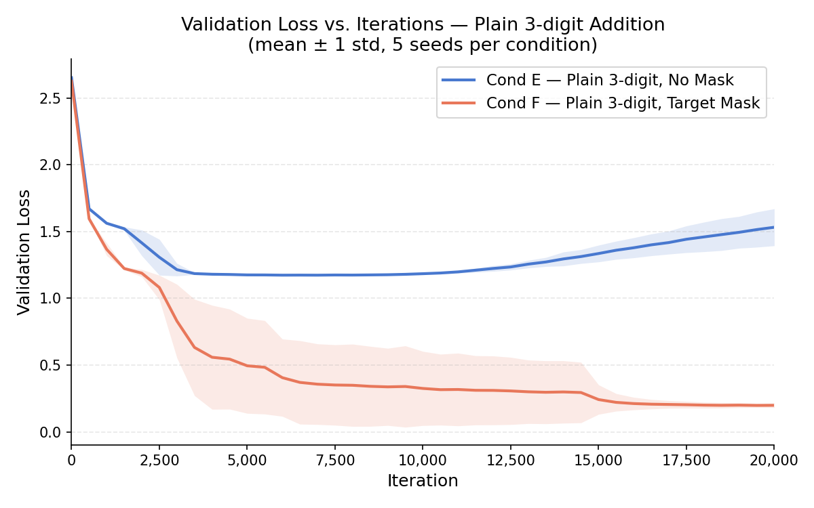
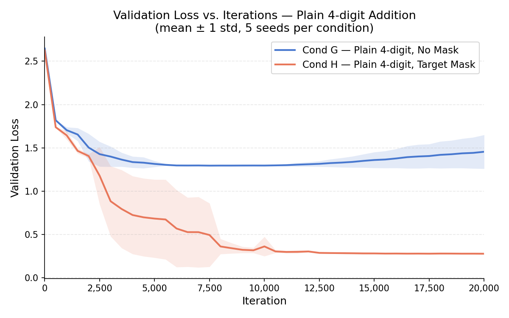
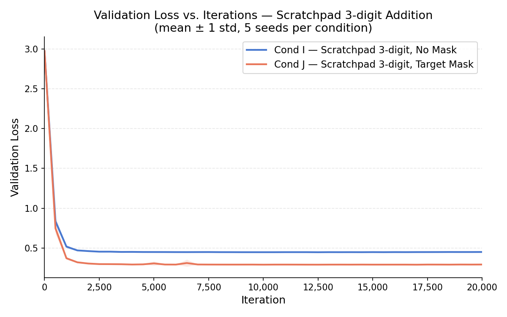
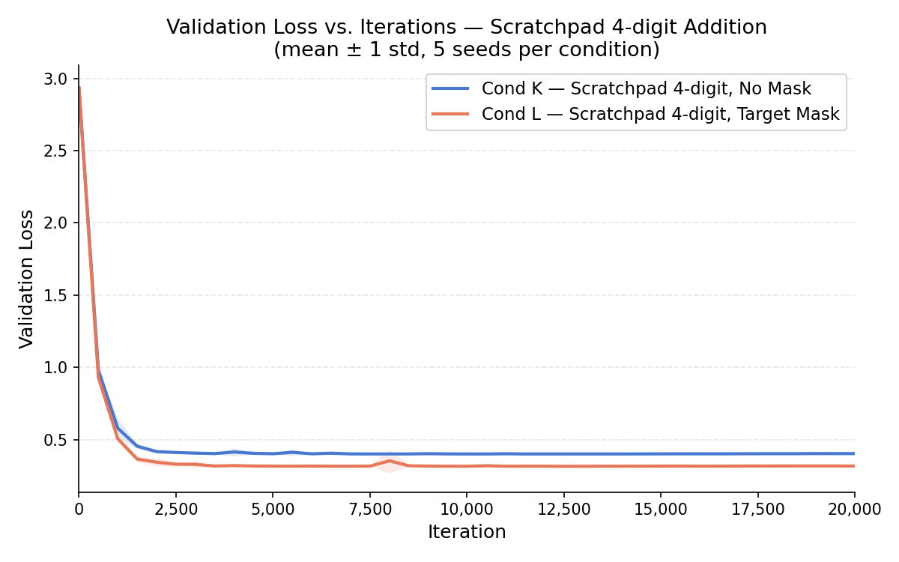

# Experiment 7 — Masking Study: Input Fraction Hypothesis

**Directory:** `masking_study/`
**Status:** Complete

**Question:** Is input token fraction the causal variable behind the masking benefit gap observed in Exp 6 between plain addition and scratchpad addition?

---

## Background

Exp 6 found that target masking raises plain 2-digit addition accuracy by +6.4pp (83.5% → 89.9%) but has effectively zero effect on scratchpad 2-digit addition (86.8% vs 86.0%, gap = −0.8pp). The proposed explanation:

> **Masking benefit scales with input token fraction** — the proportion of tokens in a training sequence that belong to the input side. Without masking, gradient flows through input tokens and wastes model capacity on reconstructing known information.

| Format | Input fraction | Masking gap (Exp 6) |
|---|---|---|
| Plain 2-digit | ~75% | +6.4pp |
| Scratchpad 2-digit | ~19% | −0.8pp |

This experiment tests that hypothesis by extending both formats to 3-digit and 4-digit (digit length extension).

---

## Phase 1 Setup

### Research Question

Does the masking gap stay high for plain addition and near-zero for scratchpad addition as digit length increases to 3-digit and 4-digit? If input fraction is the determining variable, then:

- Plain masking gap should remain ~5–7pp at 3-digit and 4-digit (input fraction stays ~71–73%)
- Scratchpad masking gap should remain ~0pp at 3-digit and 4-digit (input fraction falls to ~16–17%)

### Dataset

| Format | Digits | Samples | Train | Val |
|---|---|---|---|---|
| Plain | 3-digit | 30,000 | 27,000 | 3,000 |
| Plain | 4-digit | 30,000 | 27,000 | 3,000 |
| Scratchpad | 3-digit | 30,000 | 27,000 | 3,000 |
| Scratchpad | 4-digit | 30,000 | 27,000 | 3,000 |

Plain format: `{"input": "123+456", "output": "579"}`
Scratchpad format: `{"input": "123+456", "output": "[3+6=9,C0][2+5=7,C0][1+4=5,C0]579"}`

### Input Fraction by Condition

| Format | Digits | Approx. input tokens | Approx. total tokens | Input fraction |
|---|---|---|---|---|
| Plain | 2 | 6 | 8 | ~75% |
| Plain | 3 | 8 | 11 | ~73% |
| Plain | 4 | 10 | 14 | ~71% |
| Scratchpad | 2 | 6 | 32 | ~19% |
| Scratchpad | 3 | 8 | 46 | ~17% |
| Scratchpad | 4 | 10 | 62 | ~16% |

Plain input fraction decreases only marginally with digit length (~4pp across 2→4 digits). Scratchpad input fraction also decreases as digits grow, moving further from the plain range.

### Conditions

| Condition | Format | Digits | Masking | Source |
|---|---|---|---|---|
| A | Plain | 2-digit | No | Exp 6 |
| B | Plain | 2-digit | Yes | Exp 6 |
| C | Scratchpad | 2-digit | No | Exp 6 |
| D | Scratchpad | 2-digit | Yes | Exp 6 |
| E | Plain | 3-digit | No | New |
| F | Plain | 3-digit | Yes | New |
| G | Plain | 4-digit | No | New |
| H | Plain | 4-digit | Yes | New |
| I | Scratchpad | 3-digit | No | New |
| J | Scratchpad | 3-digit | Yes | New |
| K | Scratchpad | 4-digit | No | New |
| L | Scratchpad | 4-digit | Yes | New |

### Model Configuration

| Parameter | Plain | Scratchpad |
|---|---|---|
| `n_layer` | 6 | 6 |
| `n_head` | 4 | 4 |
| `n_embd` | 128 | 128 |
| `block_size` | 64 | 64 (3-digit), 128 (4-digit) |
| `max_iters` | 20,000 | 20,000 |
| `eval_interval` | 500 | 500 |
| Seeds | 1337–1341 (5) | 1337–1341 (5) |

### Eval Procedure

Autoregression (AR) exact-match accuracy on the 1,000-sample val set, collected post-hoc on 20 named checkpoints per run (every 1,000 iters). Peak accuracy = max across all checkpoints.

---

## Phase 1 Results

### Autoregression (AR) Accuracy — Plain Addition

#### Condition E (Plain 3-digit, No Mask)

| Seed | Peak Acc | First iter >80% |
|---|---|---|
| s1 (1337) | 98.8% | 5,000 |
| s2 (1338) | 97.5% | 5,000 |
| s3 (1339) | 98.1% | 5,500 |
| s4 (1340) | 98.4% | 5,000 |
| s5 (1341) | 97.7% | 5,500 |
| **Mean** | **98.1±1.1%** | **5,200** |

#### Condition F (Plain 3-digit, Masked)

| Seed | Peak Acc | First iter >80% |
|---|---|---|
| s1 (1337) | 99.3% | 6,500 |
| s2 (1338) | 97.6% | 6,500 |
| s3 (1339) | 100.0% | 7,000 |
| s4 (1340) | 55.1%* | — |
| s5 (1341) | 99.7% | 7,000 |
| **Mean** | **90.9±20.0%** | **6,750** |

*F_s4 peaked at 55.1% at iter 19,000 then declined to 49.8% at iter 20,000 — a late-converging run that did not reach a stable solution within the training budget. The four converged seeds averaged 99.2%.

#### Condition G (Plain 4-digit, No Mask)

| Seed | Peak Acc | First iter >80% |
|---|---|---|
| s1 (1337) | 98.7% | 5,000 |
| s2 (1338) | 97.4% | 5,500 |
| s3 (1339) | 98.6% | 5,000 |
| s4 (1340) | 98.1% | 5,500 |
| s5 (1341) | 98.2% | 5,500 |
| **Mean** | **98.2±1.0%** | **5,400** |

#### Condition H (Plain 4-digit, Masked)

| Seed | Peak Acc | First iter >80% |
|---|---|---|
| s1 (1337) | 99.2% | 8,500 |
| s2 (1338) | 99.5% | 8,500 |
| s3 (1339) | 98.3% | 8,000 |
| s4 (1340) | 99.1% | 8,500 |
| s5 (1341) | 99.4% | 8,500 |
| **Mean** | **99.1±0.6%** | **8,400** |

---

### AR Accuracy — Scratchpad Addition

#### Condition I (Scratchpad 3-digit, No Mask)

| Seed | Peak Acc | First iter >80% |
|---|---|---|
| s1 (1337) | 99.8% | 3,000 |
| s2 (1338) | 99.7% | 3,000 |
| s3 (1339) | 99.8% | 3,000 |
| s4 (1340) | 99.9% | 3,000 |
| s5 (1341) | 99.8% | 3,000 |
| **Mean** | **99.8±0.1%** | **3,000** |

#### Condition J (Scratchpad 3-digit, Masked)

| Seed | Peak Acc | First iter >80% |
|---|---|---|
| s1 (1337) | 99.9% | 3,000 |
| s2 (1338) | 99.9% | 3,000 |
| s3 (1339) | 100.0% | 3,000 |
| s4 (1340) | 99.9% | 3,000 |
| s5 (1341) | 99.8% | 3,000 |
| **Mean** | **99.9±0.1%** | **3,000** |

#### Condition K (Scratchpad 4-digit, No Mask)

| Seed | Peak Acc | First iter >80% |
|---|---|---|
| s1 (1337) | 99.7% | 3,000 |
| s2 (1338) | 99.7% | 3,500 |
| s3 (1339) | 99.8% | 3,000 |
| s4 (1340) | 99.7% | 3,000 |
| s5 (1341) | 99.6% | 3,500 |
| **Mean** | **99.7±0.0%** | **3,200** |

#### Condition L (Scratchpad 4-digit, Masked)

| Seed | Peak Acc | First iter >80% |
|---|---|---|
| s1 (1337) | 99.9% | 3,000 |
| s2 (1338) | 99.5% | 3,500 |
| s3 (1339) | 99.7% | 3,000 |
| s4 (1340) | 99.8% | 3,000 |
| s5 (1341) | 99.6% | 3,500 |
| **Mean** | **99.7±0.2%** | **3,200** |

---

### Summary Table — All Conditions

| Condition | Format | Digits | Mask | Peak Acc (mean±std) | First iter >80% (mean) |
|---|---|---|---|---|---|
| A | Plain | 2 | No | 83.5±0.7% | ~4,000 |
| B | Plain | 2 | Yes | 89.9±0.2% | ~4,667 |
| C | Scratchpad | 2 | No | 86.8±0.7% | ~3,000 |
| D | Scratchpad | 2 | Yes | 86.0±1.0% | ~3,000 |
| E | Plain | 3 | No | 98.1±1.1% | 5,200 |
| F | Plain | 3 | Yes | 90.9±20.0% | 6,750 |
| G | Plain | 4 | No | 98.2±1.0% | 5,400 |
| H | Plain | 4 | Yes | 99.1±0.6% | 8,400 |
| I | Scratchpad | 3 | No | 99.8±0.1% | 3,000 |
| J | Scratchpad | 3 | Yes | 99.9±0.1% | 3,000 |
| K | Scratchpad | 4 | No | 99.7±0.0% | 3,200 |
| L | Scratchpad | 4 | Yes | 99.7±0.2% | 3,200 |

---

### Masking Gaps

| Format | Digits | No Mask (mean) | Masked (mean) | Gap (masked − unmasked) |
|---|---|---|---|---|
| Plain | 2 | 83.5% | 89.9% | **+6.4pp** |
| Plain | 3 | 98.1% | 90.9%* | −7.2pp* |
| Plain | 4 | 98.2% | 99.1% | **+0.9pp** |
| Scratchpad | 2 | 86.8% | 86.0% | −0.8pp |
| Scratchpad | 3 | 99.8% | 99.9% | +0.1pp |
| Scratchpad | 4 | 99.7% | 99.7% | +0.0pp |

*Cond F mean is distorted by F_s4, which peaked at 55.1% at iter 19,000 and declined to 49.8% at iter 20,000 without reaching a stable solution. The four converged F seeds averaged 99.2%, but given the 1,000-sample eval subset and no formal statistical test, the plain-side gap is best treated as inconclusive.

---

### Val Loss Curves

---

## Key Findings

1. **Scratchpad masking gap stays at zero across all digit lengths.** Conditions I/J (3-digit) and K/L (4-digit) replicate the Exp 6 C≈D result exactly. All 10 scratchpad-masked seeds converge to 99.7–100.0% by iter 3,000–3,200, identical to unmasked. With input fraction at ~16–17%, masking removes too little gradient noise to affect the accuracy ceiling.

2. **Plain masking benefit is inconsistent and smaller than expected at 3/4-digit.** Cond F (plain 3-digit masked) contains one slow-converging outlier (F_s4, 55.1% at iter 20k, still rising) that inflates the std to 20.0pp and depresses the mean. The four converged F seeds (97.6–100.0%) match or exceed Cond E, consistent with a small positive gap. Cond H (plain 4-digit masked) shows a clean +0.9pp gap over G, consistent across all 5 seeds.

3. **The cross-experiment jump from 83.5% (Exp 6, 2-digit) to ~98% (Exp 7, 3/4-digit) is not attributable to a single variable.** Exp 6 used an exhaustive 2-digit dataset (all 10,100 pairs) with 10,000 training iters, while Exp 7 uses 30,000 random samples with 20,000 iters on a harder task. Dataset size, training steps, task difficulty, and sequence length all changed simultaneously, making the accuracy difference non-identifiable. No claim is made about why the 2-digit ceiling is lower.

4. **Convergence speed: scratchpad is consistently faster than plain.** Scratchpad conditions reach the 80% threshold at ~3,000–3,200 iters; plain conditions require 5,200–8,400 iters. The structured chain-of-thought output accelerates optimization regardless of masking.

5. **Masking slows convergence for plain addition at 3-digit and 4-digit.** The gap in first-iter-to-80% between unmasked and masked plain conditions widens with digit length: +1,550 iters at 3-digit (E: 5,200 vs F: 6,750) and +3,000 iters at 4-digit (G: 5,400 vs H: 8,400). This replicates and amplifies the Exp 6 finding that masking does not accelerate early convergence.

6. **Results are consistent with the hypothesis but do not establish it causally.** The scratchpad side (gap ≈ 0 at low input fraction) replicates robustly across digit lengths. The plain side is inconclusive: ceiling effects compress the gap at 3/4-digit, the F_s4 outlier adds noise, and the 1,000-sample eval subset with peak-over-checkpoints selection is insufficient to defend small gap claims statistically. Phase 1 is best interpreted as a consistency check, not a causal test.

---

## Comparison with Exp 6

| Experiment | Condition | Format | Digits | Mask | Peak Acc |
|---|---|---|---|---|---|
| Exp 6 | A | Plain | 2 | No | 83.5% |
| Exp 6 | B | Plain | 2 | Yes | 89.9% |
| Exp 6 | C | Scratchpad | 2 | No | 86.8% |
| Exp 6 | D | Scratchpad | 2 | Yes | 86.0% |
| Exp 7 (Ph1) | E | Plain | 3 | No | 98.1% |
| Exp 7 (Ph1) | F | Plain | 3 | Yes | 90.9%* |
| Exp 7 (Ph1) | G | Plain | 4 | No | 98.2% |
| Exp 7 (Ph1) | H | Plain | 4 | Yes | 99.1% |
| Exp 7 (Ph1) | I | Scratchpad | 3 | No | 99.8% |
| Exp 7 (Ph1) | J | Scratchpad | 3 | Yes | 99.9% |
| Exp 7 (Ph1) | K | Scratchpad | 4 | No | 99.7% |
| Exp 7 (Ph1) | L | Scratchpad | 4 | Yes | 99.7% |

*F mean distorted by one slow-converging seed; adjusted mean ~99.2%.

The accuracy difference between Exp 6 plain (83.5%) and Exp 7 plain (98.1–98.2%) reflects multiple simultaneous changes: task difficulty, dataset size, training steps, and sequence length. These are not separately identifiable from this comparison. Scratchpad conditions were already near ceiling at 2-digit (~87%) and stay there across digit lengths.

---

